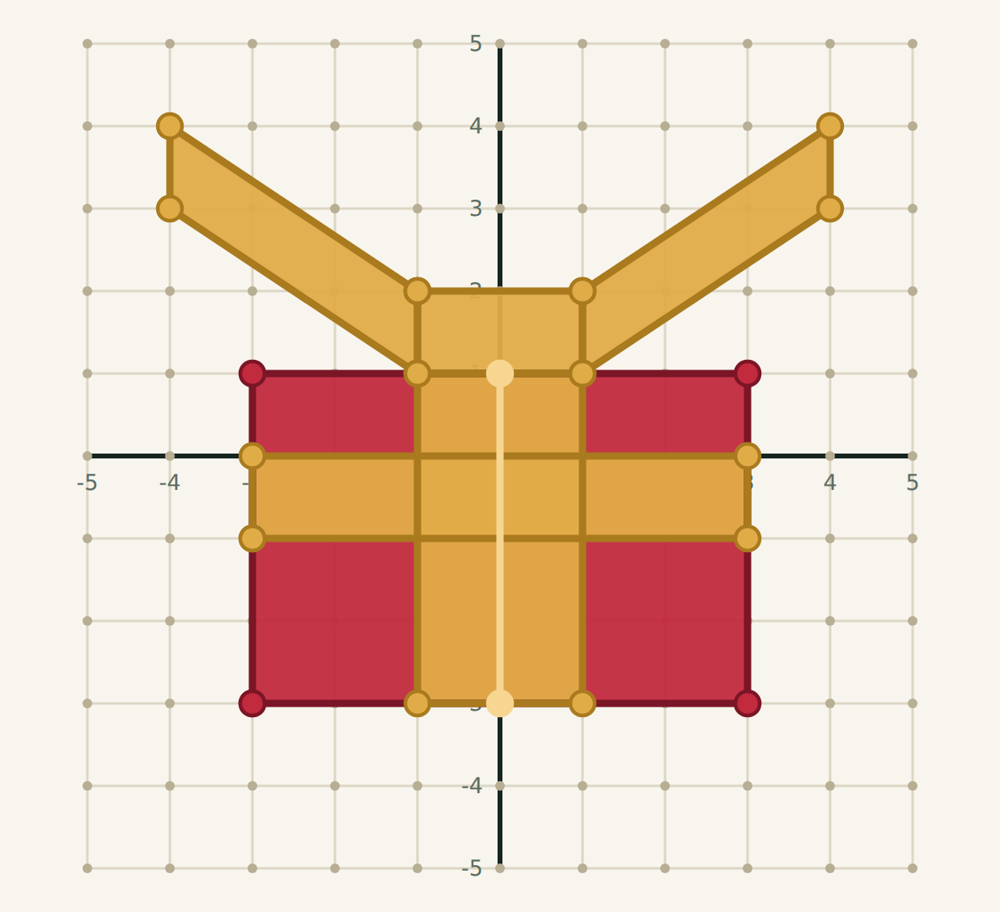
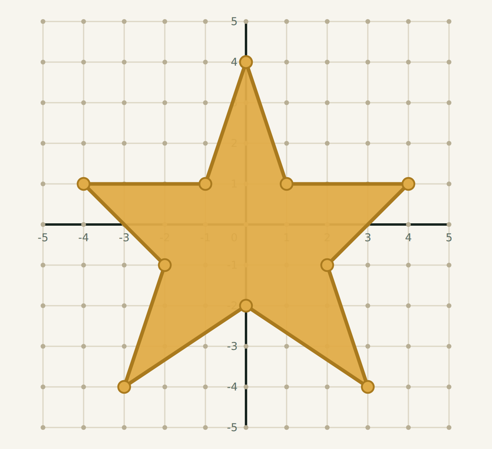
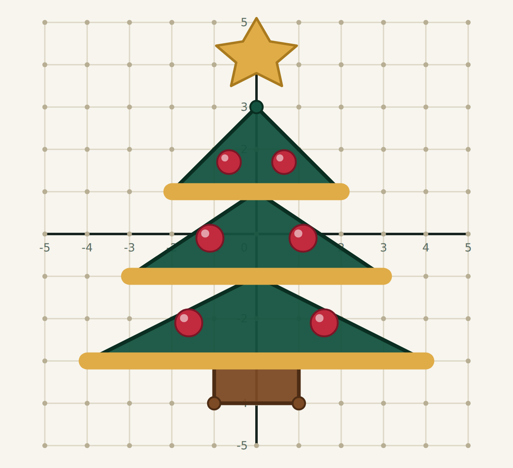

# Geometria Natalina: aprender geometria criando, explorando e jogando

## Apresentação

Geometria Natalina é um jogo educacional digital que transforma conceitos de geometria em desafios visuais com temática natalina. O estudante percorre um caderno de desafios e constrói desenhos em um plano cartesiano a partir de pontos e segmentos.

A proposta combina criatividade, raciocínio espacial e progressão gamificada. O aluno recebe experiência, avança de nível, desbloqueia desafios e acompanha suas tentativas e conquistas.

## Como funciona

Cada desafio apresenta uma figura que pode ser construída por meio da identificação de pontos, segmentos e formas geométricas. O estudante precisa observar a representação, interpretar coordenadas e reproduzir a figura no plano.

Os desafios trabalham diferentes ideias matemáticas:

- pares ordenados e localização no plano;
- segmentos de reta e composição de figuras;
- polígonos e seus elementos;
- simetria;
- triângulos e quadriláteros;
- quadrantes do plano cartesiano;
- organização espacial e visualização geométrica.

## Relação com a BNCC

As atividades podem ser articuladas principalmente às seguintes habilidades da BNCC de Matemática:

### EF06MA18 — Polígonos

Reconhecer, nomear e comparar polígonos, considerando lados, vértices e ângulos, classificando-os em regulares e não regulares, tanto em representações no plano como em faces de poliedros.

No desafio do presente e na composição da árvore, o estudante identifica e combina quadriláteros, triângulos e outros polígonos para formar uma figura maior.

### EF06MA19 — Triângulos

Identificar características dos triângulos e classificá-los em relação às medidas dos lados e dos ângulos.

A árvore de Natal é composta por diferentes triângulos sobrepostos. A atividade pode estimular a comparação de seus lados, vértices e posições.

### EF06MA16 — Plano cartesiano

Associar pares ordenados a pontos do plano cartesiano do primeiro quadrante, em situações como a localização dos vértices de polígonos.

O jogo utiliza coordenadas para indicar onde cada ponto deve ser localizado. O aluno transforma pares ordenados em posições concretas no desenho.

### EF07MA21 — Transformações geométricas

Reconhecer e construir figuras obtidas por simetrias de translação, rotação e reflexão, usando instrumentos de desenho ou softwares de geometria dinâmica.

O desafio da estrela oferece uma oportunidade de explorar simetria e regularidade, observando como partes da figura se relacionam em torno de eixos e pontos de referência.

## Competências desenvolvidas

Ao jogar, o estudante desenvolve a capacidade de:

- interpretar representações geométricas;
- localizar pontos e estabelecer relações espaciais;
- reconhecer propriedades de figuras planas;
- analisar simetrias e padrões;
- planejar uma construção antes de executá-la;
- verificar erros e ajustar estratégias;
- comunicar seu raciocínio por meio de desenhos e coordenadas.

## Gamificação e aprendizagem

A progressão por níveis e desafios cria uma sequência de aprendizagem com objetivos claros. A experiência acumulada, os desafios desbloqueados e o registro de tentativas permitem que o aluno perceba sua evolução.

A temática natalina funciona como contexto motivador, aproximando a geometria de uma produção criativa. O estudante não apenas responde a perguntas: ele constrói presentes, estrelas e árvores usando conceitos matemáticos.

## Possibilidades pedagógicas

O jogo pode ser utilizado como:

- atividade de introdução ao plano cartesiano;
- prática de identificação de polígonos;
- revisão de vértices, lados e segmentos;
- exploração de simetria;
- atividade complementar em aulas de geometria;
- proposta de aprendizagem baseada em desafios;
- instrumento de avaliação formativa.

O professor pode propor que os alunos expliquem quais figuras aparecem em cada desenho, indiquem os pares ordenados utilizados, comparem os polígonos e criem novas figuras temáticas.

## Síntese

Geometria Natalina transforma a aprendizagem de geometria em uma experiência criativa, visual e interativa. Por meio de desafios contextualizados, o aluno desenvolve habilidades relacionadas ao plano cartesiano, às figuras planas, aos polígonos, aos triângulos e às transformações geométricas.

O jogo cria uma ponte entre matemática e criação artística: cada desenho natalino é também uma oportunidade para observar, localizar, comparar, construir e justificar relações geométricas.

**Referência:** Base Nacional Comum Curricular — Matemática, documento oficial do Ministério da Educação: https://basenacionalcomum.mec.gov.br/images/BNCC_20dez_site.pdf
